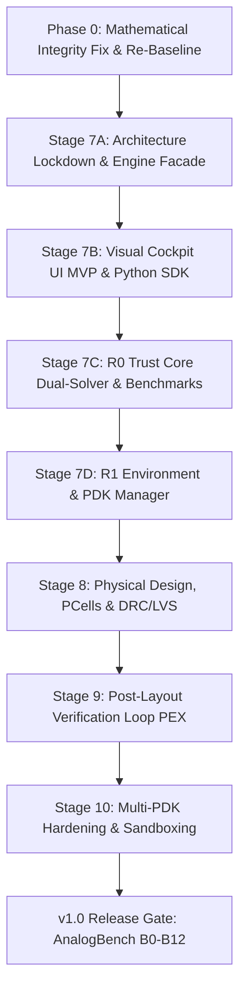

# planchanges.md — OpenVirtuoso Master Architecture & Stage Roadmap

> **Canonical System Planning Document & Stage Transition Record**  
> **Repository**: `RobinBroG/moneymoney`  
> **Constitutional Authority**: [`AGENT2.md`](AGENT2.md) (v1.0-frozen)  
> **Source Plan**: [`docs/master-plan-v1.md`](docs/master-plan-v1.md) (v7.1 as amended) & `final_build.md` (v3.2)  
> **Status**: Comprehensive Planning Specification — Build Halted

---

## 1. Executive Summary & Strategic Evolution

### 1.1 Product Mission
**OpenVirtuoso** is an open-source, AI-native, standalone analog IC design platform delivering a complete **spec-to-verified-design** workflow on open process design kits (PDKs), with zero Cadence dependency, zero proprietary licenses, and zero coexistence hacks.

- **Primary Audiences**:
  1. **Students & Universities**: Eliminate the weeks of license setup, remote X11 lag, and cryptic error messages. Provide an explainable, interactive environment with instant feedback on analog physics.
  2. **Practicing Engineers & Startups**: Eliminate the brutal \$100k+/seat license barrier for planar nodes (SkyWater 130nm, GF 180nm, TSMC 65nm). Accelerate days of repetitive manual sizing into minutes of autonomous, verified optimization.
- **The Core Moat**: Autonomous, grounded sizing and cited failure explanations—not a cloned 1990s editor.
- **The Golden Rule**: *"The agent proposes, the simulator decides, and the human commits."*

### 1.2 Why the Plan Evolved (`final_build.md` v3.2 $\to$ `AGENT2.md` & `master-plan-v1.md` v7.1)
As Stages 0 through 6 were implemented and verified, critical insights reshaped the forward plan:

1. **The Phase Margin Wrap Defect (`VERIFY-PM-001`)**:
   In Stage 6, the two-stage Miller op-amp achieved an apparent $152.4^\circ$ phase margin. Code audit revealed this was an unwrap artifact (true continuous phase was $\approx -335^\circ$, which wrapped to $+25^\circ$, and `180 - abs(phase)` returned $+155^\circ$ for a violently unstable circuit). `AGENT2.md` §8 immediately codified the **Signed-Measurement Policy** and made unwrapping mandatory.
2. **Strangler Pattern for `DesignEngine v0.1`**:
   To prevent architectural decay, all UI, CLI, AI, and SDK callers must route through `DesignEngine v0.1`. Direct imports of `sqlite3`, `libngspice`, or schema internals are permanently banned and enforced via automated architecture CI tests.
3. **Dual-Solver Trust Core (Xyce Cross-Check)**:
   Relying on a single solver (`ngspice`) creates silent risk. Integrating Sandia’s `Xyce` as an independent cross-check backend with a formal `SIMULATOR_DISAGREEMENT` quarantine protocol establishes authentic industrial trust.
4. **Early UI MVP**:
   Rather than deferring UI to the very end, an early read-only/low-mutation Visual Cockpit (schematic renderer, waveform viewer, run center, and AI evidence panel) is prioritized immediately after architectural lockdown.

---

## 2. Baseline Architecture Ledger (Stages 0–6: Completed & Verified)

All foundation code for the core simulation, circuit representation, and knowledge engine is already built, tested, and green (**305 passed, 29 skipped base; 334 passed EDA**):

```
Stage 0: Engine & Packaging ─────────► Pinned Docker containers, DesignEngine v0.1 API, CI
Stage 1: Units & Schema AST ─────────► SI base units, Relational AST, Byte-identical SPICE compiler
Stage 2: libngspice & Workers ───────► C-bindings, Worker isolation pool (JobRunner), Repro IDs
Stage 3: Metric Contracts ───────────► 7 Canonical metrics (Tian loop, loaded fixtures, evaluator)
Stage 4: Optimization Layer ─────────► Optuna TPE integration, Experiment ledger
Stage 4.5: Robustness Engine ────────► 5-corner PVT matrix, Geometric Monte Carlo, Wilson intervals
Stage 5: AI Diagnostics & Copilot ───► 12-category taxonomy classifier, LLMProvider, Provenance
Stage 6: Topology Intelligence ──────► 6 Parametric templates, AI-03 Retriever, Proposal IR
```

---

## 3. Comprehensive Stage-by-Stage Forward Roadmap



---

### Phase 0: Mathematical Integrity & Sizing Re-Baseline (`VERIFY-PM-001`)
* **Goal**: Eradicate phase wrapping artifacts, enforce signed measurements, and re-baseline the Stage 6 Two-Stage Miller op-amp proposal on genuine physical truth.
* **Key Deliverables**:
  1. **Continuous Phase Unwrap Algorithm (`metrics/phase_margin.py`)**:
     - Detect $2\pi$ discontinuities ($|\Delta \theta| > 180^\circ$) across the frequency vector.
     - Enforce canonical signed calculation: $\mathbf{\text{PM} = 180^\circ + \theta(f_u)}$.
     - Stability classification: `STABLE` ($\text{PM} \ge 45^\circ$), `MARGINAL` ($0^\circ \le \text{PM} < 45^\circ$), `UNSTABLE` ($\text{PM} < 0^\circ$).
     - Preserve backward-compatible `extract_phase_margin(...) -> float` while adding `extract_phase_margin_detailed(...) -> PhaseMarginData`.
  2. **Multi-Pole Adversarial Test Suite (`tests/test_phase_margin.py`)**:
     - Single-pole lag (PM $\approx +95.7^\circ$).
     - Two-pole critically damped (PM $= +60.0^\circ$).
     - Barkhausen oscillator zero crossing (PM $= 0.0^\circ$).
     - Multi-pole unstable systems (PM $= -45.0^\circ$).
     - **The 6F Bug Replication**: $-335^\circ$ lag at unity gain must assert $\text{PM} = -155.0^\circ$ (`UNSTABLE`) and NEVER report $+155^\circ$.
     - Branch-cut bracket crossing ($-179^\circ \to -181^\circ$).
  3. **Two-Stage Miller Op-Amp Sizing Re-Baseline (`sim/miller_opamp.py`)**:
     - Update analytical physics model to authentic pole-zero equations (dominant pole $\omega_{p1}$, output pole $\omega_{p2}$, LHP/RHP zero $\omega_z$).
     - Update Optuna cost function with strict stability penalty for $\text{PM} < 60^\circ$.
     - Re-run sizing to obtain a genuinely stable sizing ($A_v \ge 60\text{ dB}$, $f_u \ge 40\text{ MHz}$, $\text{PM} \ge 60^\circ$).
  4. **Documentation & Human Checkpoint**:
     - Document ADR-025 in `DECISIONS.md`.
     - Update `Tasks_Comp.md` and `To-Do.md`.
     - Emit blocking human checkpoint alert block.

---

### Stage 7A / Phase 1: Architectural Lockdown & Engine Facade
* **Goal**: Establish the permanent, unified public API surface and enforce strict architectural boundary insulation.
* **Key Deliverables**:
  1. **`DesignEngine v0.1` Facade Consolidation (Strangler Pattern)**:
     - Implement the 11 canonical plan methods in `src/analog_ic_design/engine/design_engine.py`:
       `create_project()`, `create_cell()`, `instantiate()`, `validate()`, `netlist()`, `simulate()`, `check_constraints()`, `optimize()`, `run_drc()`, `extract()`, `compare()`.
     - Pure delegation to underlying modules (`circuit/`, `sim/`, `metrics/`, `optimize/`, `topology/`). Zero logic moves.
  2. **Architecture CI Import Guard (`tests/test_architecture_boundary.py`)**:
     - AST-based static analyzer running in CI.
     - Fails build if any UI, AI, CLI, or test script directly imports `sqlite3`, `libngspice`, `ngspice.py`, or schema internals. All access must cross `DesignEngine`.
  3. **Database Migration v9 (`store/schema.py`)**:
     - `checkpoint_registry` table: Tracks formal human signoff events, evidence IDs, reviewer, verdict, timestamp.
     - `design_state` table: State machine tracking:
       $$\text{DRAFT} \to \text{SIMULATION\_READY} \to \text{NOMINAL} \to \text{PVT} \to \text{MC} \to \text{LAYOUT\_READY} \to \text{PHYSICAL\_VERIFIED} \to \text{RELEASED}$$
     - Dependency invalidation triggers: Editing a schematic parameter resets dependent downstream verification states.

---

### Stage 7B / Phase 2: The Visual Cockpit (UI MVP) & Python SDK
* **Goal**: Deliver a lightweight, high-performance web cockpit and programmatic SDK so students and engineers can visualize, simulate, and verify circuits without legacy desktop software.
* **Key Deliverables**:
  1. **FastAPI Web Server (`src/analog_ic_design/ui/server.py`)**:
     - Thin REST/WebSocket gateway calling `DesignEngine v0.1` exclusively.
  2. **Hierarchical Schematic Viewer (SVG / Canvas)**:
     - Clean schematic rendering generated directly from SQLite relational netlists.
     - Click-to-probe nodes, display device sizes ($W, L, M$), and highlight floating/shorted nets visually.
  3. **Run Center & Simulation Monitor**:
     - Interactive controls to run DC Operating Point, AC Frequency Response, Transient, and PVT sweeps.
     - Real-time background job progress bar powered by `JobRunner`.
  4. **Interactive Waveform Viewer (WebGL / Canvas)**:
     - 60fps pan/zoom Bode plots (Magnitude in dB, Phase in degrees with unwrapping indicator).
     - Transient step-response viewer with automatic risetime, settling time, and overshoot markers.
  5. **Evidence & AI Explainer Panel**:
     - Surfaces Stage 5 grounded AI narrations, displaying cited `ErrorRecord` and `Measurement` IDs with zero hallucination.
  6. **OpenVirtuoso Python SDK (`openvirtuoso`)**:
     - Pip-installable programmatic client for Jupyter notebooks, headless scripts, and CI/CD pipelines.
  7. **Playwright Equivalence Suite (`tests/test_ui_equivalence.py`)**:
     - Automated browser tests verifying that netlists generated via UI match Python API netlists byte-for-byte.

---

### Stage 7C / Phase 3: R0 Trust Core (Dual-Solver Engine & Benchmarks)
* **Goal**: Eliminate single-solver bias by introducing independent numerical cross-verification.
* **Key Deliverables**:
  1. **Xyce Independent Simulator Backend (`src/analog_ic_design/sim/xyce.py`)**:
     - Integrate Sandia National Laboratories' open-source parallel SPICE simulator behind the existing `Simulator` ABC.
  2. **Simulator Disagreement Protocol (`src/analog_ic_design/sim/disagreement.py`)**:
     - Automated cross-simulation runner on identical golden netlists.
     - Discrepancies exceeding numerical tolerance policies are quarantined as `SIMULATOR_DISAGREEMENT` for human adjudication rather than silently picking a winner.
     - Generates side-by-side solver delta reports.
  3. **Hierarchical Netlist Compiler (`src/analog_ic_design/circuit/compiler.py` v2)**:
     - Extend netlist compiler from flat subcircuits to arbitrary subcircuit nesting hierarchies.
  4. **AnalogBench Golden Benchmark Suite (B0–B7)**:
     - B0: CMOS Inverter
     - B1: NMOS Current Mirror
     - B2: Differential Pair with Active Load
     - B3: Common-Source Amplifier
     - B4: Telescopic Cascode Gain Stage
     - B5: Folded Cascode Operational Transconductance Amplifier
     - B6: Two-Stage Miller Operational Amplifier
     - B7: Bandgap Voltage Reference

---

### Stage 7D / Phase 4: R1 Environment & Design Management
* **Goal**: Equip the platform with enterprise-grade testbench abstraction, noise extraction, and multi-PDK qualification.
* **Key Deliverables**:
  1. **Testbench Manager**:
     - Decouple the Device Under Test (DUT) from testbench instrumentation (Tian injection loops, AC sources, load capacitors, bias supplies).
     - Reusable, parametric testbench templates assigned to cells with a single command.
  2. **Small-Signal Noise & Distortion Extraction (`metrics/noise.py`)**:
     - SPICE `.noise` analysis extractor into the `MetricContract` matrix.
     - Input-referred noise density ($\text{V}/\sqrt{\text{Hz}}$), integrated noise ($\mu\text{V}_{\text{rms}}$), and corner frequency ($f_c$).
  3. **PDK Manager & Second PDK Spike Scorecard**:
     - Formal comparison spike evaluating GlobalFoundries 180nm MCU (open foundry PDK) vs. FreePDK45.
     - Measure model completeness, BSIM versions, DRC/LVS deck availability, and install footprint.
     - Record selection in `DECISIONS.md` (ADR-026).
  4. **Convergence Assistant UX**:
     - Visual diagnostic overlay for operating point failures (showing high-impedance nodes, non-conducting bias paths, and suggested stepping parameters).

---

### Stage 8: Physical Design, PCells, and DRC/LVS Flow
* **Goal**: Transform schematic designs into manufacturable GDSII polygons with automated DRC and LVS verification.
* **Key Deliverables**:
  1. **`LayoutBackend` Multi-Tool Spike**:
     - Primary geometry engine: KLayout Python API (`klayout.db`).
     - DRC engine: KLayout DRC script runner.
     - LVS engine: Netgen netlist-vs-layout comparison.
  2. **Deterministic Parametric Cell (PCell) Generators**:
     - Parameterized Python layout generators for Sky130 devices:
       - NMOS / PMOS multi-finger transistors.
       - Interdigitated / common-centroid differential pairs.
       - MIM (Metal-Insulator-Metal) and fringe capacitor arrays.
       - Precision poly resistors.
     - AI constraint guard: AI proposes geometric constraints (matching style, guard rings), never raw polygon vertex coordinates.
  3. **Mandatory KLayout Visual Checkpoint Gate (`AGENT2.md` §8 & §14)**:
     - On the first clean DRC/LVS pass of each benchmark cell, the platform captures a visual screenshot (`artifacts/layout/<cell>.png`) and halts at a **blocking human checkpoint** for visual human confirmation before the PCell generator is cleared for reuse.

---

### Stage 9: Post-Layout Verification Loop (PEX)
* **Goal**: Close the physical verification loop by extracting layout parasitics and quantifying electrical degradation against pre-layout specs.
* **Key Deliverables**:
  1. **Parasitic Extraction Engine (PEX)**:
     - Extraction backend (Magic / KLayout) generating extracted `.subckt` with distributed interconnect resistance ($R$) and ground/coupling capacitance ($C$).
  2. **Closed-Loop Post-Layout Simulation**:
     - Automatically routes the extracted parasitic netlist back into the Stage 3 `MetricContract` testbenches.
  3. **Pre- vs. Post-Layout Degradation Dashboard**:
     - Side-by-side performance delta table:
       - DC Gain: Pre-layout ($62.1\text{ dB}$) vs. Post-layout ($58.4\text{ dB}$).
       - UGB: Pre-layout ($44.2\text{ MHz}$) vs. Post-layout ($37.8\text{ MHz}$).
       - Phase Margin: Pre-layout ($63.5^\circ$) vs. Post-layout ($54.1^\circ$).
     - Parasitic sensitivity analysis identifying the exact nets causing bandwidth or stability degradation.

---

### Stage 10: Multi-PDK Hardening & Security Sandboxing
* **Goal**: Harden the platform into an enterprise-grade, multi-PDK, secure operating environment.
* **Key Deliverables**:
  1. **Second Open PDK Full Integration (GlobalFoundries 180nm)**:
     - Implement `GF180PDKAdapter` adhering to the `PDKAdapter` ABC.
     - Proves that the platform, netlist compiler, and PCell generators have zero hardcoded Sky130 assumptions.
  2. **Container Security & Process Sandboxing**:
     - Hard resource isolation (CPU quota, RAM cap, execution timeouts, network isolation via gVisor / Firejail).
     - Strict workspace isolation: proprietary user netlists, parameters, and PDK decks are physically prevented from leaking across projects or reaching external networks (`LOCAL_ONLY` execution mode).
  3. **Continuous Performance & Accuracy Telemetry**:
     - Automated benchmarks tracking simulation wall-clock time, memory footprint, and numerical solver convergence rates.

---

### v1.0 Release Gate: AnalogBench Signoff & Commercial Launch
* **Goal**: Validate the complete product against professional benchmarks and release to the market.
* **Key Deliverables**:
  1. **AnalogBench B0–B12 Full Certification**:
     - All 13 canonical analog benchmark circuits pass pre-layout simulation, DRC, LVS, and post-layout PEX verification across 5 PVT corners.
  2. **Student & Professional User Study Trials**:
     - Educational trial: Time-to-first-working-circuit for undergraduate students (<2 hours vs. 2 weeks in Cadence Virtuoso).
     - Professional trial: Time-to-sized-candidate for analog engineers (<30 minutes vs. 3 days of manual ADE sweeps).
  3. **Commercial Deployment Architecture**:
     - **Open-Source Local Core (Apache 2.0 / MIT)**: Fully functional local Docker / desktop tool for individual students and researchers.
     - **Commercial Cloud / Enterprise Tier**: Managed multi-user workspace, team collaboration, centralized experiment database, and enterprise closed PDK bridges.

---

## 4. Architectural Extensibility for Enterprise & Commercial Tools

A fundamental architectural requirement is that **when capital, enterprise partnerships, and foundry connections arrive, OpenVirtuoso can immediately interface with industry-standard commercial tools without rewriting the platform**.

This capability is guaranteed by the three decoupled Abstract Base Classes in `src/analog_ic_design/interfaces/`:

```
┌─────────────────────────────────────────────────────────────────────────────┐
│                    OpenVirtuoso Public Application Layer                    │
│             (Web Cockpit / Python SDK / Optuna Sizing / AI Copilot)         │
└──────────────────────────────────────┬──────────────────────────────────────┘
                                       │
                                       ▼
┌─────────────────────────────────────────────────────────────────────────────┐
│                          DesignEngine v0.1 Facade                           │
└──────────────┬───────────────────────┬───────────────────────┬──────────────┘
               │                       │                       │
               ▼                       ▼                       ▼
   ┌───────────────────────┐ ┌───────────────────┐ ┌───────────────────────┐
   │     Simulator ABC     │ │ LayoutBackend ABC │ │    PDKAdapter ABC     │
   └───────────┬───────────┘ └─────────┬─────────┘ └───────────┬───────────┘
               │                       │                       │
       ┌───────┴───────┐       ┌───────┴───────┐       ┌───────┴───────┐
       │               │       │               │       │               │
       ▼               ▼       ▼               ▼       ▼               ▼
   [ngspice]       [Spectre] [KLayout]     [Calibre] [Sky130]       [TSMC 28]
    (Open)       (Commercial) (Open)     (Commercial) (Open)      (Commercial)
```

1. **Commercial Simulators (Cadence Spectre, Synopsys HSPICE, Siemens Eldo)**:
   - Implement `class SpectreBackend(Simulator)` in `src/analog_ic_design/sim/spectre.py` (~150 lines).
   - Netlist in $\to$ raw vectors out. The rest of the platform (metrics, optimizer, UI, AI) runs identically with zero changes.
2. **Commercial Physical Verification (Siemens Calibre, Cadence Pegasus)**:
   - Implement `class CalibreBackend(LayoutBackend)`.
   - `run_drc()` and `run_lvs()` invoke Calibre runsets and return standard `VerificationReport(passed=True/False)`.
3. **Foundry Closed PDKs (TSMC 65nm / 28nm / 16nm, Intel 16)**:
   - Implement `class TSMCPDKAdapter(PDKAdapter)`.
   - Maps device models to TSMC model cards, enforces design rule minima, and protects foundry IP behind `LOCAL_ONLY` execution.

---

## 5. Constitutional Invariants & Operational Rules (`AGENT2.md`)

Every task executed across all stages must strictly abide by the Four Fundamental Laws:

1. **Law 1**: Never mark a stage done on agent judgment. All done-when criteria and checkpoints are confirmed by the human.
2. **Law 2**: Never write PDK model bindings or layer syntax from memory. Always quote local PDK reference files.
3. **Law 3**: Zero bypass of the pre-simulation validation gate (`validate()`). Schema, connectivity, units, and limits must pass before reaching any simulator.
4. **Law 4**: Zero private side doors to ngspice, Xyce, KLayout, or SQLite. All callers route exclusively through `DesignEngine v0.1`.
5. **Strict SI Units**: All quantities in storage, parameters, code, and APIs are SI base units (meters, Farads, Ohms, Volts, Amperes, Seconds, Hertz). No prefix parsing outside display presentation.
6. **One Task = One Commit = One Testable Claim**: Commits are strictly bounded to 100–250 lines (max 400).
7. **Absolute Honesty**: Empirical verification over plausible fiction. Everything is labeled `MEASURED` or `PREDICTED`.

---

## 6. Forward Execution Sequencing

| Sequence | Milestone | Deliverables | Verification Gate |
|---|---|---|---|
| **Step 1** | **Phase 0** | Phase margin unwrap algorithm, signed PM reporting, wrap regression tests, Miller re-baseline | Multi-pole tests pass, no wrap artifacts, ADR-025 |
| **Step 2** | **Stage 7A** | `DesignEngine v0.1` facade consolidation, AST architecture CI test, Migration v9 (design state & checkpoints) | Zero illegal imports, state machine verified |
| **Step 3** | **Stage 7B** | Web Cockpit UI MVP (schematic, waveform, run center, AI explainer), Python SDK | Playwright automated tests, SDK round-trip |
| **Step 4** | **Stage 7C** | Xyce independent backend, simulator disagreement protocol, AnalogBench B0–B7 | Xyce vs ngspice delta report, zero silent drift |
| **Step 5** | **Stage 7D** | Testbench Manager, PDK Manager, Noise extraction, GF180 vs FreePDK45 spike scorecard | Decoupled testbenches, ADR-026 |
| **Step 6** | **Stage 8** | KLayout PCell generators, DRC/LVS automated flow, visual review checkpoint | Clean DRC+LVS, blocking KLayout screenshot |
| **Step 7** | **Stage 9** | Parasitic extraction (PEX), closed-loop post-layout simulation & degradation dashboard | Pre- vs post-layout delta table |
| **Step 8** | **Stage 10** | GF180 second PDK full integration, container security sandboxing | Multi-PDK operational, gVisor limits active |
| **Step 9** | **v1.0 Gate**| AnalogBench B0–B12 certification, user study trials, open-source + cloud release | 100% benchmark pass, commercial readiness |

---

*(This document serves as the permanent master planning record for OpenVirtuoso. Execution begins with Step 1: Phase 0 upon explicit human confirmation.)*
